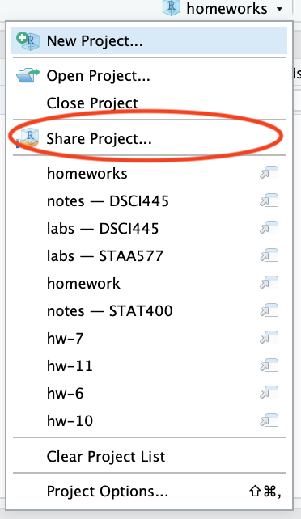

# hw-10

Homework 10 in DSCI445: Statistical Machine Learning @ CSU

## Assignment

Be sure to `set.seed(445)`.

1. We will explore the maximal margin classifier on a toy data set.

    a) We are given $n = 7$ observations in $p = 2$ dimensions. For each observation, there is an associated class label.
    
      
      | Obs| X_1| X_2|Y    |
      |---:|---:|---:|:----|
      |   1|   3|   4|Red  |
      |   2|   2|   2|Red  |
      |   3|   4|   4|Red  |
      |   4|   1|   4|Red  |
      |   5|   2|   1|Blue |
      |   6|   4|   3|Blue |
      |   7|   4|   1|Blue |
  
      Sketch the observations.
    
    b) Sketch the optimal separating hyperplane and provide the equation for this hyperplane.
  
    c) Describe the classification rule for the maximal marginal classifier. It should be along the lines of "Classify to Red if $\beta_0 + \beta_1 X_1 + \beta_2 X_2 > 0$, and classify as Blue otherwise. Provide the values of $\beta_0, \beta_1, \beta_2$.
  
    d) On your sketch, indicate the margin for the maximal margin classifier.
  
    e) Indicate the support vectors for the maximal margin classifier.
  
    f) Argue that a slight movement of the seventh observation would not affect the maximal margin hyperplane.
  
    g) Draw an additional observation on the plot so that the two classes are no longer separable by a hyperplane.
  
2. This problem involves the `OJ` data set in the `ISLR` package.

    a) Create a training set containing a random sample of 900 observations and a test set containg the remaining observations.
  
    b) Fit a support vector classifier to the training set using `cost = 0.01` with `Purchase` as the response and the other variables as predictors. Use the `summary()` function to produce summary statistics and describe the results obtained.
  
    c) What are the training and test error rates?
  
    d) Use CV to select an optimal `cost`. Consider values between $0.01$ and $10$.
  
    e) Compute the training and test error rates using this new value for `cost`.
  
    f) Repeat b) through e) using a support vector machine with a radial kernal and default value for `gamma`.
  
    g) Repeat b) through e) using a support vector machine with a polynomial kernal and `degree = 2`.
  
    h) Which approach gives the best results on this data?

Turn in in a pdf of your homework to canvas using the provided Rmd file as a template. Your Rmd file on the server will also be used in grading, so be sure they are identical.

**Be sure to share your server project with the instructor and grader. You only need to do this once per semester.**

1. Open your `homeworks` project on liberator.stat.colostate.edu
2. Click the drop down on the project (top right side) > Share Project...
    
    

    
    
plot of chunk unnamed-chunk-2

    

  
3. Click the drop down and add "dsci445instructors" to your project.

    

    
    
plot of chunk unnamed-chunk-3

    

This is how you **receive points** for reproducibility on your homework!

