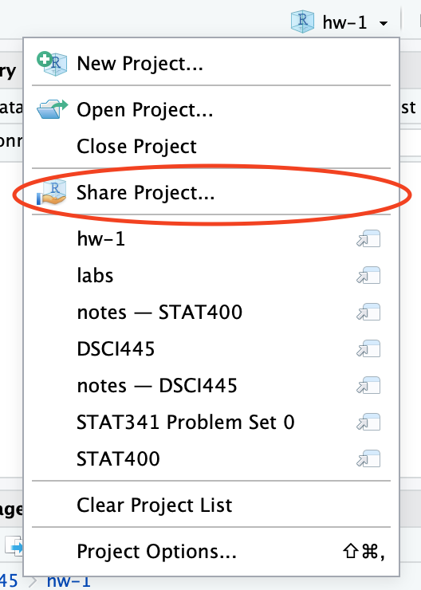

Be sure to `set.seed(400)` at the beginning of your homework. 

```{r}
#reproducibility
set.seed(400)
```


```{r}
## load the data
library(MASS)

## take a look
head(Boston)
```

1. The `MASS` package contains a data set called `Boston` which records median house value (`medv`) for $506$ neighborhoods around Boston. We will seek to predict median house value using 13 predictors, such as average rooms per house (`rm`), average age of houses (`age`), and percent of households with low socioeconomic status (`lstat`). 

    (a) Start by visually inspecting the data to get an idea of relationships that might be present (**hint:** look into the `ggpairs` function in the `GGally` package.). Describe what you see.
    
    ```{r}
    ## from the hint
    library(GGally)
    
    ## make plots and describe
    ```

    (b) For each predictor fit a simple linear regression model to predict the response. Describe your results. In which of the models is there a statistically significant association between the predictor and the response?

    (b=c) Fit a multiple regression model to predict the response using all of the predictors. Describe your results (including diagnostic plots). For which predictors can we reject the null hypothesis $H_0: \beta_j = 0$?

    (d) How do your results from (b) compare to your results from (c)? Create a plot displaying the univariate regression coefficients from (b) on the $x$-axis and the multiple regression coefficients from (c) on the $y$-axis. That is, each predictor is displayed as a single point on the plot. Its coefficient in a simple linear regression model is shown as its $x$ coordinate and its coefficient in a multiple linear regression model is shown as its $y$ coordinate. Describe what you see.

 
Turn in in a pdf of your analysis to canvas using the provided Rmd file as a template. Your Rmd file on the server will also be used in grading, so be sure they are identical.

**Be sure to share your server project with the instructor and grader. You only need to do this once per semester.**

1. Open your `homeworks` project on liberator.stat.colostate.edu
2. Click the drop down on the project (top right side) > Share Project...
    
    ```{r, echo=FALSE, out.width="25%"}
    
    ```
  
3. Click the drop down and add "dsci445instructors" to your project.

    ```{r, echo=FALSE, out.width="25%"}
    knitr::include_graphics("share_dropdown.png")
    ```

This is how you **receive points** for reproducibility on your homework!
