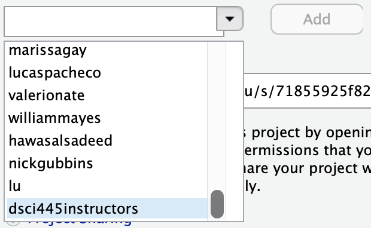

# hw-4

Homework 4 in DSCI445: Statistical Machine Learning @ CSU

## Assignment

1. Suppose we collect data for a group of students in a statistics class with variables $X_1 =$ hours studied, $X_2 =$ undergrad GPA, and $Y =$ receive an A. We fit a logistic regression and produce estimated coefficients, $\hat{\beta}_0 = -6, \hat{\beta}_1 = 0.05, \hat{\beta}_2 = 1$.

    (a) Estimate the probability that a student who studies for $40$h and has an undergrad GPA of $3.5$ gets an A in the class.
    
    (b) How many hours would the student in part (a) need to study to have a $50\%$ chance of getting an A in the class?
    
2. This question should be answered using the `Weekly` data set, which is part of the `ISLR` package. This data contains weekly percentage returns for the S&P 500 stock index between 1990 and 2010.

    (a) Produce some numerical and graphical summaries of the `Weekly` data. Do there appear to be any patterns?
    
    (b) Use the full data set to perform a logistic regression with `Direction` as the response and the five lag variables plus `Volume` as predictors. Use the summary function to print the results. Do any of the predictors appear to be statistically significant? If so, which ones?
    
    (c) Compute the confusion matrix and overall fraction of correct predictions. Explain what the confusion matrix is telling you about the types of mistakes made by logistic regression.
    
    (d) Now fit the logistic regression model using a traning data period from 1990 to 2009 with `Lag2` as the only predictor. Compute the confusion matrix and the overall fraction of correct predictions for the held out data (that is the data from 2010).
    
    (e) Repeat (d) using LDA.
    
    (f) Repeat (d) using KNN with K = 1.
    
    (h) Which of these methods appears to provide the best results on this data?
    
    (i) Experiment with different combinations of predictors, including possible transformations and interactions, for each of the methods. Report the variables, method, and associated confusion matrix that appears to provide the best results on the held out data. Note that you can experiment with values for $K$ in the KNN classifier.
    
Turn in in a pdf of your homework to canvas using the provided Rmd file as a template. Your Rmd file on the server will also be used in grading, so be sure they are identical.

**Be sure you have shared your server project with the instructor and grader. You only need to do this once per semester.**

1. Open your `homeworks` project on liberator.stat.colostate.edu
2. Click the drop down on the project (top right side) > Share Project...
    
    

    
    
plot of chunk unnamed-chunk-1

    

  
3. Click the drop down and add "dsci445instructors" to your project.

    

    
    
plot of chunk unnamed-chunk-2

    

This is how you **receive points** for reproducibility on your homework!

